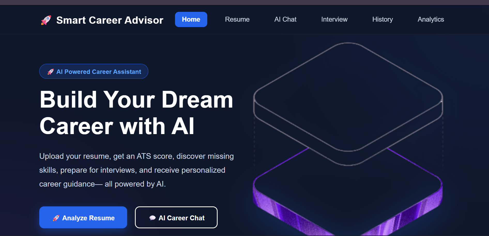
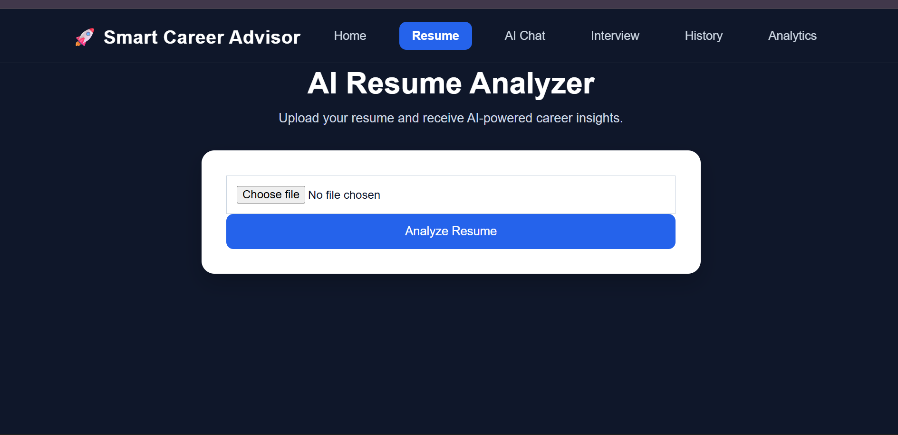
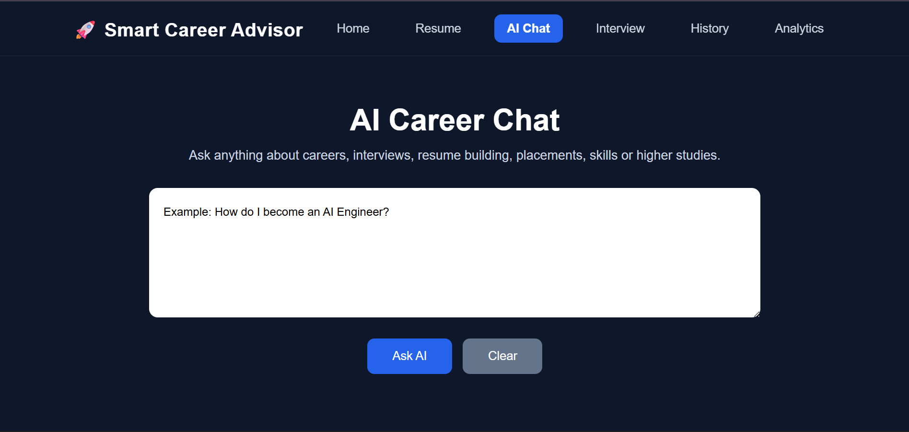
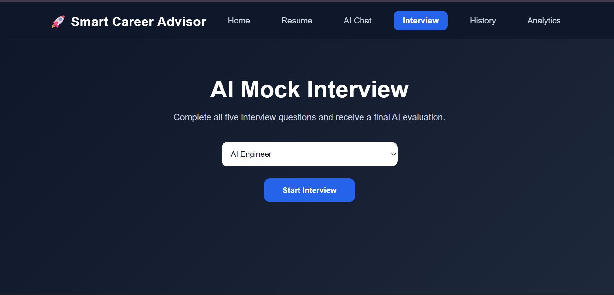
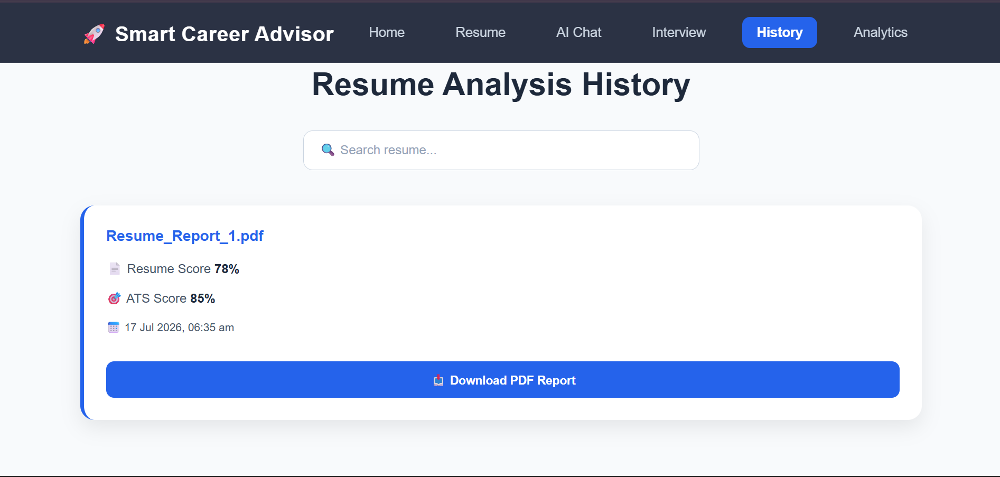
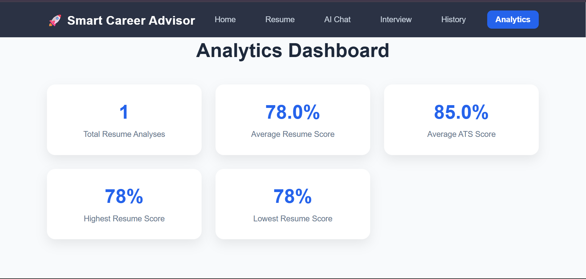

# 🚀 Smart Career Advisor

### AI-powered Career Guidance Platform built with React, Flask & Gemini AI


---

## 📖 About

Smart Career Advisor is an AI-powered web application that helps students and job seekers improve their resumes, analyze ATS compatibility, practice AI-powered mock interviews, chat with an AI career assistant, and track their progress through an analytics dashboard.

---

## ✨ Features

- 📄 AI Resume Analyzer
- 🤖 Gemini AI Career Chat
- 🎤 AI Mock Interview
- 📊 ATS Score Analysis
- 📈 Analytics Dashboard
- 📝 Resume History
- 📥 PDF Report Generation
- 📱 Responsive UI
- ☁️ Cloud Deployment (Vercel + Render)

---

## 🛠️ Tech Stack

| Frontend | Backend | AI | Database | Deployment |
|----------|----------|----|----------|------------|
| React | Flask | Gemini AI | SQLite | Vercel |
| HTML | Python | Google AI Studio | SQL | Render |
| CSS | REST API | Prompt Engineering | | GitHub |

---

## 🏗️ Architecture

```text
User
   │
   ▼
React Frontend (Vercel)
   │
REST API
   │
Flask Backend (Render)
   │
 ├── Gemini AI
 └── SQLite Database
```

---

## 📸 Screenshots

### 🏠 Home


### 📄 Resume Analyzer


### 🤖 AI Chat


### 🎤 Mock Interview


### 📜 Resume History


### 📊 Analytics Dashboard


---

## 🚀 Installation

```bash
git clone https://github.com/codeWithKiru/Smart-Career-Advisor.git

cd Smart-Career-Advisor

# Frontend
cd frontend
npm install
npm run dev

# Backend
cd ../backend
pip install -r requirements.txt
python app.py
```

---

## 🔗 Live Demo

**Frontend:** https://smart-career-advisor-gamma.vercel.app

**Backend:** https://smart-career-advisor-0wzj.onrender.com

---

## 🚀 Future Scope

- 🔐 User Authentication
- 📄 AI Resume Builder
- 🎙️ Voice-based Mock Interview
- 💌 AI Cover Letter Generator
- 🧠 Personalized Learning Roadmaps
- 💼 Real-time Job Recommendations
- 🌍 Multi-language Support
- ☁️ Cloud Resume Storage
- 📱 Mobile Application

---

## 👩‍💻 Author

**Kiruthika M E**

GitHub: https://github.com/codeWithKiru

LinkedIn: https://www.linkedin.com/in/kiruthika-m-e-83a521276

---

# ⭐ Support

If you like this project, consider giving it a ⭐ on GitHub.
